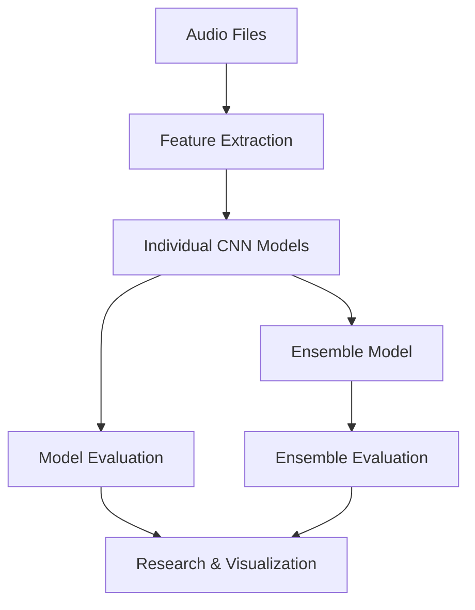

# EnsembleSoundClassifier

A comprehensive pipeline for automatic musical instrument classification using deep learning and ensemble methods. This project is designed for research and thesis work, focusing on the systematic evaluation of audio features, model architectures, and ensemble strategies for instrument recognition.

---

## Pipeline Overview



The pipeline consists of:
- **Audio ingestion and database management**
- **Feature extraction and augmentation**
- **Training of individual CNN models for each feature type**
- **Ensemble model construction and evaluation**
- **Comprehensive analysis and visualization of results**

---

## Usage

1. **Environment Setup**
   - Use Docker Compose in `environment/` or install dependencies manually.
2. **Audio Ingestion**
   - Run `AddSamplesToDB.ipynb` to add audio files and metadata to the database.
3. **Feature Extraction & Augmentation**
   - Execute `preprocess.ipynb` to extract features (mel-spectrogram, MFCC, chromagram, etc.) and apply augmentations.
4. **Model Training & Evaluation**
   - Use `model.ipynb` to train CNNs for each feature type and construct the ensemble model.
5. **Visualization & Reporting**
   - Generate figures and summaries with `show_report.ipynb`.

---

## Results

### Individual Model Performance

| Feature Type         | Mean Accuracy | Std Dev  |
|----------------------|--------------|----------|
| Mel Spectrogram      | 0.9416       | 0.0055   |
| Mfcc                 | 0.8242       | 0.0078   |
| Chromagram           | 0.4672       | 0.0291   |
| Spectral Contrast    | 0.4880       | 0.0167   |
| Tonnetz              | 0.5009       | 0.0193   |
| Constant Q           | 0.9207       | 0.0122   |
| Stft                 | 0.8254       | 0.0130   |
| Harmonic Percussive  | 0.9466       | 0.0070   |
| Onset Strength       | 0.3129       | 0.0082   |

### Ensemble Model Performance

| Model     | Mean Accuracy | Std Dev  |
|-----------|--------------|----------|
| Ensemble  | 0.9685       | 0.0022   |

### Fold-wise Accuracy Ranges

| Feature Type         | Min Accuracy | Max Accuracy |
|----------------------|--------------|--------------|
| Mel Spectrogram      | 0.9355       | 0.9482       |
| Mfcc                 | 0.8149       | 0.8339       |
| Chromagram           | 0.4187       | 0.5020       |
| Spectral Contrast    | 0.4748       | 0.5166       |
| Tonnetz              | 0.4797       | 0.5264       |
| Constant Q           | 0.9028       | 0.9355       |
| Stft                 | 0.8046       | 0.8451       |
| Harmonic Percussive  | 0.9365       | 0.9580       |
| Onset Strength       | 0.3034       | 0.3239       |
| Ensemble             | 0.9653       | 0.9722       |

### Statistical Significance: Ensemble vs. Best Individual Model

A paired t-test was performed to compare the accuracy of the ensemble model with the best-performing individual model (harmonic_percussive) across all folds:

```
Paired t-test p-value (ensemble vs best individual): 0.00079807
Difference is statistically significant (p < 0.05)
```

**Interpretation:**  
A p-value of 0.0008 (p < 0.05) indicates that the improvement in accuracy from the ensemble model over the best individual model is statistically significant. This means the ensemble’s superior performance is unlikely to be due to random chance, and ensembling genuinely improves classification accuracy in this context.

---

## Visualizations

### Overall Performance


*Comparison of mean accuracies for individual models and the ensemble.*


*Accuracy improvement of the ensemble over individual models by feature type.*


*Distribution of model accuracies across cross-validation folds.*

### Ensemble Model Analysis


*Confusion matrix for the ensemble model (Fold 3).*  


*F1-score comparison: ensemble vs. individual models.*


*Precision comparison: ensemble vs. individual models.*


*Recall comparison: ensemble vs. individual models.*

### Individual Feature Model Confusion Matrices


*Confusion matrix for the Harmonic Percussive model (Fold 3).*  


*Confusion matrix for the Mel Spectrogram model (Fold 4).*  


*Confusion matrix for the Onset Strength model (Fold 1).*  

---

## Research Insights

- **Feature Effectiveness:**
  - Harmonic Percussive and Mel Spectrogram features yield the highest individual model accuracies.
  - Onset Strength and Chromagram features perform significantly worse, highlighting the importance of feature selection.
- **Ensemble Advantage:**
  - The ensemble model consistently outperforms all individual models, with statistically significant improvement.
  - Ensemble accuracy is both higher and more stable across folds.
- **Metric Analysis:**
  - The ensemble model shows superior F1, precision, and recall compared to individual models, as visualized above.
- **Confusion Patterns:**
  - Confusion matrices reveal which instrument classes are most frequently misclassified, guiding future improvements.

---

## Project Structure

- `AddSamplesToDB.ipynb` — Audio ingestion & database update
- `preprocess.ipynb` — Feature extraction & augmentation
- `model.ipynb` — Model training & evaluation
- `show_report.ipynb` — Visualization & reporting
- `modules/PostgresDBHandler.py` — Database handler
- `environment/` — Docker & database setup
- `figures/` — Saved graphics and visualizations

---

## License

MIT License

---

For questions or collaboration, please open an issue or contact the project maintainer.
